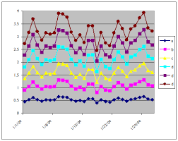
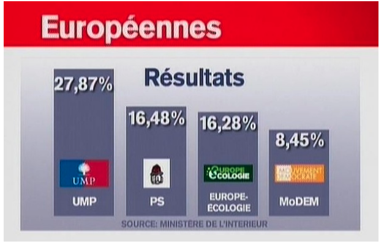
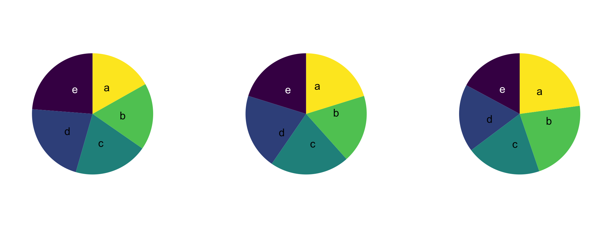
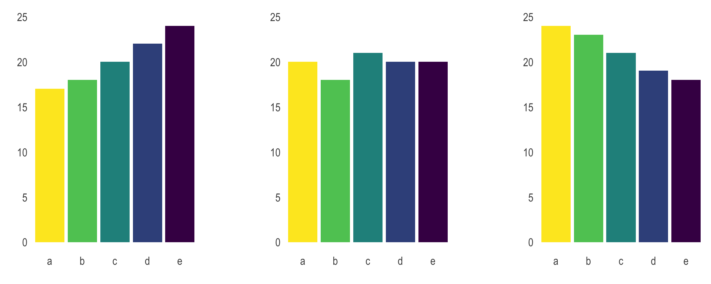

## Why data visualization ?

1.  Exploration and description
2.  Communication
3.  Aesthetics

## What makes a bad visualization ?

1. Aesthetics : ugly
2. Substantive : wrong
3. Perceptual : bad

## Ugly charts

{fig-align="center"}

## Wrong charts

{fig-align="center"}

## Perceptual : Forget about pie charts (the so-called "camemberts") {.smaller}

-   One of the first graphs that comes in our mind when we think about dataviz
-   If you have already done that once, it will not happen again
-   We want to understand relative sizes but humans are bad at judging angles
-   Use barcharts instead : humans are better at judging bar lengths (William Cleveland)

## Bar charts instead of pie charts

::: {layout-nrow="2"}
{width="600" fig-align="center"}

{width="600" fig-align="center"}
:::

## Many more caveats

-   Colors that communicates nothing
-   Cutting Y axis
-   More caveats [here](https://www.data-to-viz.com/caveats.html)

