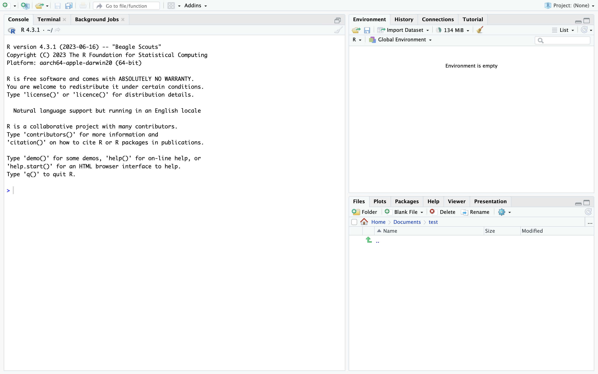

# Setting up R and Rstudio {.unnumbered}

The goal of this course is to apply what you learn in the introduction to quantitative methods' course by learning **programming**. This involves giving instructions to your computer to perform operations on quantitative data using code. The course focuses on coding with the programming language R, using the software RStudio.

To get the first session off to a good start and avoid wasting too much time setting up, **you must bring a laptop with R and Rstudio installed**. Instructions are provided below. This should be fairly quick. If you have any issues to install these programs correctly, **please contact me before the first class**.

R and RStudio are two different things. R is a programming language and software widely used for statistical analysis. While it is possible to use the default software directly, many (if not most) prefer to use RStudio instead. RStudio is an integrated development environment (IDE) that provides a much more functional and user-friendly interface to interact with R, which is why we choose to use it. However, we still need to install R before installing RStudio, as the latter relies on the former to function properly.

## Install R {.unnumbered}

You can install R from [CRAN](https://cloud.r-project.org/) (The comprehensive R Archive Network). On CRAN, you will find links to download the version of R you need for your operating system (Windows, Mac or Linux). Once the download is complete, you need to execute the installer.

## Install Rstudio {.unnumbered}

Once R is set up, you can install Rstudio. For this, go on this [webpage](https://posit.co/download/rstudio-desktop/), download Rstudio and follow the instructions.

## Set preferences and check if everything works {.unnumbered}

Once the installation of both R and Rstudio is complete, you should open Rstudio. If everything worked, something very similar to the screenshot below should appear. If it doesn't open, restart your latptop and try again.



RStudio has some default settings that are worth changing to adopt best practices. Please do the following:

-   Tools /Global options/RGeneral : Save workspace to never and uncheck the box `Restore .Rdata into workspace at startup`.

While R provides a series of basic commands for data manipulation, many of the functionalities we will use come from **packages** that need to be installed and loaded via RStudio. The most well-known package we will use is called `tidyverse`. To check if your installation is successful and you are ready to start the course, copy-paste the following code into the console pane and press enter. It might take a few minutes, and at the end, you should see the same message as the one below.

```{r}
#| eval: false
if (!require(tidyverse)) {install.packages("tidyverse")}
```

```{r}
#| echo: false
suppressWarnings(library(tidyverse))
```

## Installation issues

If you do not see the message above, welcome in the world of troubleshooting! Depending on your operating system (MacOS, Windows, Linux) and the configuration of your computer, the installation process may not go as smoothly as expected. Here are some common issues and how to solve them:

### Mac

If a message appears saying that the package cannot be found, try the following :

```{r}
#| warning: false
if (!require(tidyverse)) {devtools::install_github("hadley/tidyverse")}
```

### Windows

If a message appears saying that the package cannot be found, try to install Rtools by copying and pasting the following code into the console pane.

```{r}
if (Sys.info()["sysname"] == "Windows") {
  install.packages("Rtools")
}
```

If a message appears that Rtools is not available, download it from [here](https://cran.r-project.org/bin/windows/Rtools/rtools42/rtools.html). Then restart your computer and try to install the tidyverse package again.

**If all of this does not work or you have different types of issues, please contact me.**
